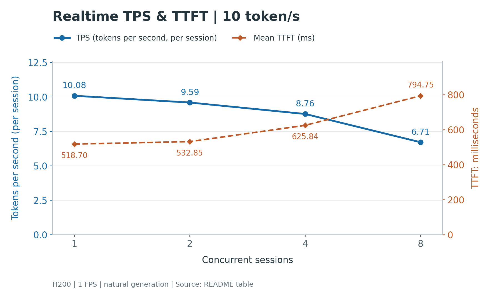
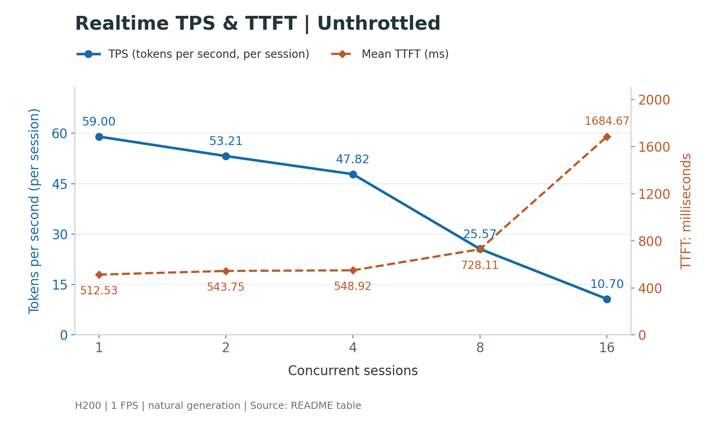

# MOSS-VL Realtime 测试

## 环境

先按[安装指南](../../docs/get_started/installation.md)创建本仓库的独立 Python 3.12 环境并安装版本约束，
准备一张 80 GB 级别及以上显存的空闲 GPU，以及本地
[MOSS-VL-Realtime-SGLANG](https://huggingface.co/OpenMOSS-Team/MOSS-VL-Realtime-SGLANG) 模型目录。

以下命令在仓库根目录执行。模型路径是唯一必填参数，测试样例已内置，无需额外准备。

## 三项测试

| 入口 | 测试内容 | 默认配置 |
| --- | --- | --- |
| [test_accuracy.sh](./test_accuracy.sh) | HF/SGLang 任务结果、token 和逐事件输出对齐，以及各后端单/多路一致性 | 1、2、4 路，自然生成 |
| [test_latency.sh](./test_latency.sh) | HF/SGLang 不限速单路基准：prefill、帧处理、首 token、TPOT 和吞吐 | 固定输入与 64 个生成 token，预热后计时 5 轮 |
| [test_concurrency.sh](./test_concurrency.sh) | 实时单/多路场景：首段可见文本时延、token 间隔和速度 | 1、2、4、8 路；每路 1 FPS、10 token/s，重复 3 轮 |

精度测试按受控输入顺序比较输出；多路时延测试中，每路独立按时间表送帧、提问和接收，
不等待其他会话，也不等待回答结束。多路测试采用自然生成，支持限速和不限速两种配置。

默认使用 BF16、HF eager、SGLang FlashInfer + decode CUDA Graph；
启动与 SGLang 测试共用 `config.json` 中的 `mem_fraction_static=0.5`。
测试关闭视觉滑窗、pooling 和 async decode。时延为后端进程内测量，不包含网络、网关或 Demo。

## 使用

```bash
bash deployment/moss_vl_realtime/test_accuracy.sh /path/to/model
bash deployment/moss_vl_realtime/test_latency.sh /path/to/model
bash deployment/moss_vl_realtime/test_concurrency.sh /path/to/model
```

默认自动选择一张空闲卡。HF/SGLang 对照在同一卡上顺序执行，多路测试的全部会话也在同一卡上。

```bash
# 指定 GPU，并调整多路实验参数
bash deployment/moss_vl_realtime/test_concurrency.sh /path/to/model \
  --gpus 2 --sessions 1 2 4 8 --fps 1 --token-rate 10 --repeats 3
```

- 通用：`--gpus` 指定设备，`--output-dir` 指定新的结果目录，`--dry-run` 检查配置。
- 精度：`--strict-tokens` 将 token/事件不一致视为失败。
- 时延：`--repeats` 调整重复次数；多路另支持 `--sessions`、`--fps`、`--token-rate`。
- HF/SGLang 对照可用 `--gpus 2,3` 并行加速；正式速度比较优先使用同一卡。多路测试只接受一张卡。

其余选项见各入口的 `--help`。`PYTHON=/path/to/python` 可指定解释器。
测试使用本地模型，不使用代理，不停止已有服务。
测试 worker 使用独立进程组，结束时清理该组中的残留子进程；清理超时会明确报错。

## 结果

报告分别写入 `results/accuracy/`、`results/latency/`、`results/concurrency/` 下的独立运行目录。
每次保留 Markdown 报告、`summary.json`、原始输出、运行参数和日志。
显存使用 NVML 每 50 ms 采样，覆盖模型加载和测试；`*_memory.json` 保留字节值与峰值。
显存以 80 GB 级别为容量参考，单独记录峰值，不作为硬通过门槛。

`PASS` 表示对应自动检查通过；`FAIL` 表示执行或检查失败；
`REVIEW` 表示需要核对输出差异。多路报告额外记录逐路指标、发送迟到、待处理事件和未响应情况。

## 参考结果

测试环境：NVIDIA H200 单卡，BF16；PyTorch 2.11.0、Transformers 5.12.1、
SGLang 0.5.16、FlashInfer 0.6.14，`mem_fraction_static=0.5`。
时间单位为毫秒，TPS（Tokens Per Second）单位为 tokens/s。
实时 TTFT 计到首段可见文本；TPOT 和 TPS 按连续回答期间计算，排除静默期。

### 精度对齐

结果：**PASS**。

| Sessions | HF 任务通过 | SGLang 任务通过 | 跨后端 token 与事件一致 | 两端各自与单路一致 |
| ---: | ---: | ---: | ---: | ---: |
| 1 | 4/4 | 4/4 | 4/4 | 4/4 |
| 2 | 4/4 | 4/4 | 4/4 | 4/4 |
| 4 | 4/4 | 4/4 | 4/4 | 4/4 |

共 12 组配对，任务结果、token、逐事件输出及单/多路一致性检查全部通过。

### 单路基准（不限速）

结果：**PASS**。

| 指标 | HF 均值 / P95 | SGLang 均值 / P95 | 均值加速比 |
| --- | --- | --- | ---: |
| Initial prefill | 45.58 / 49.30 | 42.62 / 55.71 | 1.07x |
| Frame extend | 106.99 / 218.37 | 88.95 / 129.57 | 1.20x |
| Prompt TTFT | 91.77 / 124.42 | 33.57 / 35.17 | 2.73x |
| TPOT | 52.05 / 61.73 | 11.08 / 26.97 | 4.70x |

Decode 吞吐：HF **19.21 token/s**，SGLang **90.26 token/s**。

### 实时多路时延（10 token/s）

结果：**PASS**。

| Sessions | 帧处理 P95 | TTFT 均值 / P95 | TPOT 均值 / P95 | 每路平均 token/s | 最慢一路 token/s |
| ---: | ---: | --- | --- | ---: | ---: |
| 1 | 142.56 | 518.70 / 910.41 | 99.21 / 128.02 | 10.08 | 10.08 |
| 2 | 222.93 | 532.85 / 1025.32 | 104.23 / 152.86 | 9.59 | 9.58 |
| 4 | 298.19 | 625.84 / 1135.57 | 114.13 / 235.76 | 8.76 | 8.65 |
| 8 | 385.91 | 794.75 / 1315.16 | 148.31 / 490.91 | 6.71 | 6.03 |



图中左轴为每路平均 TPS，右轴为首段可见文本的平均 TTFT（ms）。

该配置用于观察 10 token/s 目标下的并发体验：4 路平均 8.76 tokens/s，8 路平均 6.71 tokens/s。
这是实时自然生成场景，与不限速固定 token 的单路基准分别衡量。

三项测试的显存采样峰值如下；整卡列包含驱动及既有基础占用。

| 实验 | VLM 进程峰值 GiB | 整卡峰值 GiB | 整卡峰值 GB |
| --- | ---: | ---: | ---: |
| 精度对齐 | 74.779 | 76.093 | 81.705 |
| 单路时延 | 71.014 | 72.328 | 77.661 |
| 独立多路时延 | 72.879 | 74.193 | 79.664 |

`1 GiB=2^30 bytes`，`1 GB=10^9 bytes`。显存约为 80 GB 级别，不影响三项测试的通过结论。

### 实时多路时延（不限速）

结果：**PASS**。

测试纯 SGLang-Omni 后端在 1/2/4/8/16 路并发下的速度和响应时延。
每路 1 FPS、自然生成，`token_rate=86400`；不接入 Demo、memory、ASR、TTS 或网络链路。
测试会话容量为 16，生产默认仍为 4 路。

```bash
bash deployment/moss_vl_realtime/test_concurrency.sh /path/to/model \
  --sessions 1 2 4 8 16 --fps 1 --token-rate 86400 --repeats 3
```

| Sessions | 帧处理 P95 | TTFT 均值 / P95 | TPOT 均值 / P95 | 每路平均 TPS（tokens/s） | 最慢一路 TPS（tokens/s） |
| ---: | ---: | --- | --- | ---: | ---: |
| 1 | 157.50 | 512.53 / 974.75 | 16.95 / 27.45 | 59.00 | 59.00 |
| 2 | 233.59 | 543.75 / 1040.60 | 18.76 / 27.81 | 53.21 | 50.93 |
| 4 | 234.78 | 548.92 / 1026.21 | 21.43 / 27.92 | 47.82 | 45.26 |
| 8 | 401.91 | 728.11 / 1334.30 | 39.03 / 143.36 | 25.57 | 23.70 |
| 16 | 491.57 | 1684.67 / 3556.17 | 93.27 / 686.57 | 10.70 | 9.21 |



图中左轴为每路平均 TPS，右轴为首段可见文本的平均 TTFT（ms）。

并发从 1 路增加到 16 路时，每路平均速度从 59.00 降至 10.70 tokens/s，
平均 TTFT 从 512.53 增至 1684.67 ms。

## 推理启动

```bash
bash deployment/moss_vl_realtime/start.sh /path/to/model
```

默认单卡、4 个 session，服务地址 `http://127.0.0.1:18500`；
健康检查 `GET /health`，实时接口 `WS /v1/video/realtime`。
可选 `--gpus 2 --port 18510`，其余默认值见 [config.json](./config.json)。
